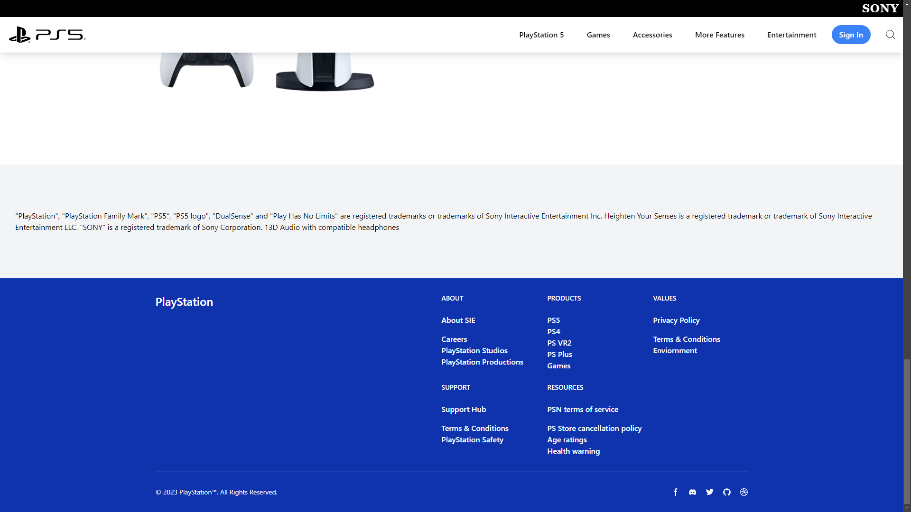

# PS5 Website Clone

A static frontend clone of the PlayStation 5 website, built using React, Tailwind CSS, and Next.js. This project showcases modern web development techniques and responsive design principles.

## Table of Contents

- [Features](#features)
- [Technologies Used](#technologies-used)
- [Screenshots](#screenshots)

## Features

- Modern UI components styled with Tailwind CSS
- Static site generation with Next.js

## Technologies Used

- **React**: A JavaScript library for building user interfaces.
- **Next.js**: A React framework for server-side rendering and static site generation.
- **Tailwind CSS**: A utility-first CSS framework for creating custom designs.
- **Vercel** (or your chosen hosting provider): For deploying the static site.

## Screenshots

